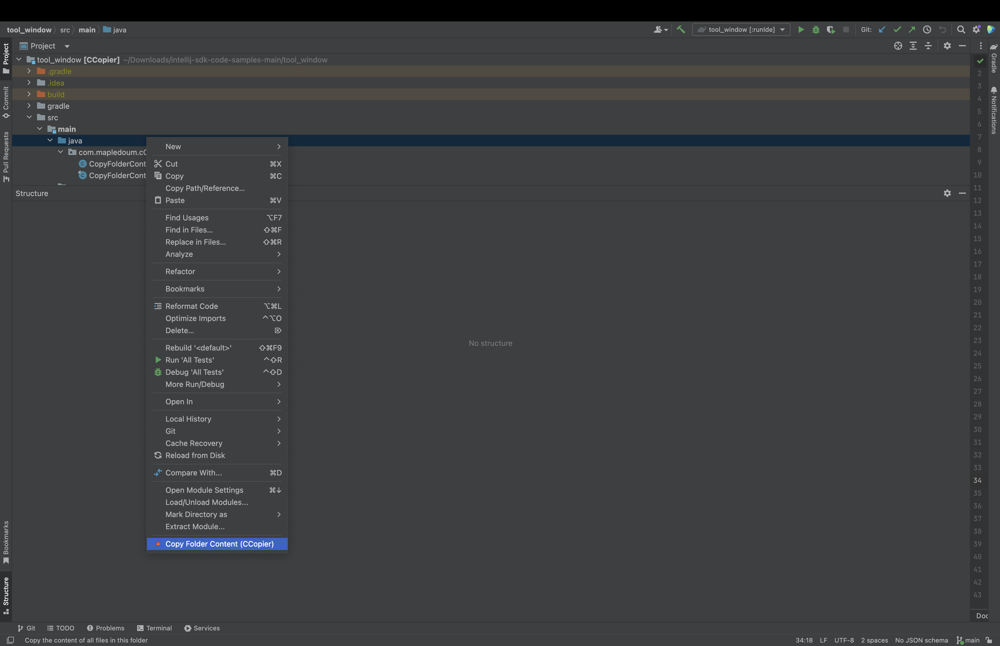
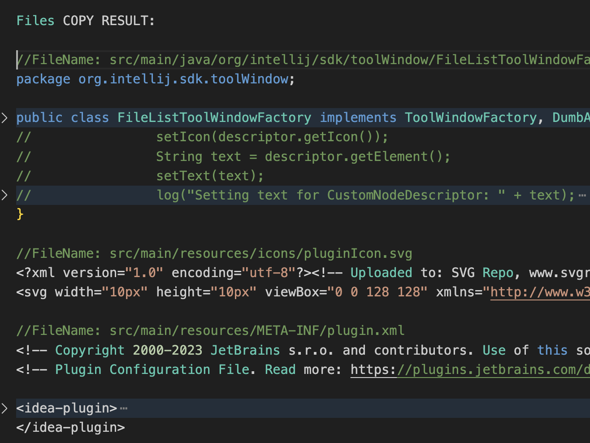

## CCopier: Multi-File Code Copy for AI Tasks
### Streamline Your Workflow with Intelligent Code Copying
CCopier is a plugin designed to enhance your coding experience in IntelliJ IDEA. It's the perfect tool for developers who frequently need to share code snippets, prepare examples for AI-assisted coding, or document their projects efficiently.

#### Key Features

1. **One-Click Multi-File Copy**: Select a folder, right-click, and copy the content of all files instantly.
2. **Customizable Output**: Tailor the copied content to your needs with our flexible YAML configuration.
3. **Smart Path Handling**: Choose between relative or absolute file paths to suit your context.
4. **Configurable Separators**: Clearly distinguish between files in your copied content with custom separators.
5. **Comment Prefixing**: Automatically add customizable comment prefixes to file names and instructions.

#### How It Works

1. Install CCopier from the JetBrains Marketplace.
2. Right-click on any folder in your Project view.
3. Select "Copy Folder Content (CCopier)" from the context menu.
4. Paste your perfectly formatted code snippet wherever you need it!





#### Customization

CCopier is highly customizable. Create a `cCopier.yaml` file in your project root to override default settings:

```yaml
top_instruction: "# Project: MyAwesomeApp"
to_file_instructions: "# File contents:"
comment_prefix: "#"
file_prefix: "File: "
use_relative_paths: true
file_separator: "\n---\n"
include_last_separator: false
```

```yaml
# cCopier Configuration File

# Top instruction: This message appears at the beginning of the copied content.
# It can be used to provide context or instructions for the copied content.
# Default: empty (no top instruction)
top_instruction:

# File instructions: This message appears before the content of each file.
# It can be used to introduce or explain each file's content.
# Default: empty (no file instructions)
to_file_instructions: "Content of the file:"

# Comment prefix: The symbol(s) used to denote comments in the copied content.
# This is used for the top instruction and file instructions.
# Common values: "#", "//", "/*", "--"
# Default: "//"
comment_prefix: "//"

# File prefix: Text that appears before each file path in the copied content.
# This can be used to clearly mark the beginning of each file's section.
# Default: empty (no file prefix)
file_prefix: "File:"

# Use relative paths: Determines whether to use paths relative to the project root.
# If false, full file paths will be used.
# Possible values: true, false
# Default: true
use_relative_paths: false

# File separator: The string used to separate content from different files.
# This allows for clear distinction between files in the copied content.
# Common values: "\n\n", "\n---\n", "\n\n\n"
# Default: "\n\n"
file_separator: "\n---\n"

# Include last separator: Determines whether to include the file separator after the last file.
# Possible values: true, false
# Default: false
include_last_separator: true

# Note: cCopier will use these settings to format your copied content.
# You can customize this file to suit your specific needs and preferences.
# Happy copying with cCopier - Your Multi-File Code Copy Solution!
```

#### Use Cases

- **AI-Assisted Coding**: Quickly prepare context for AI coding assistants.
- **Documentation**: Easily include multiple file contents in your project docs.
- **Code Reviews**: Share relevant parts of your project effortlessly.
- **Teaching**: Create comprehensive code examples for students or colleagues.

#### Why Choose CCopier?

- **Time-Saving**: No more manual copying and formatting of multiple files.
- **Consistency**: Ensure your code snippets always follow the same format.
- **Flexibility**: Adapt the output to various platforms and use cases.
- **Seamless Integration**: Works right in your IDEA context menu.

#### Get Started

Install CCopier today and transform the way you share and document your code. Say goodbye to tedious copy-pasting and hello to efficient, formatted code sharing!